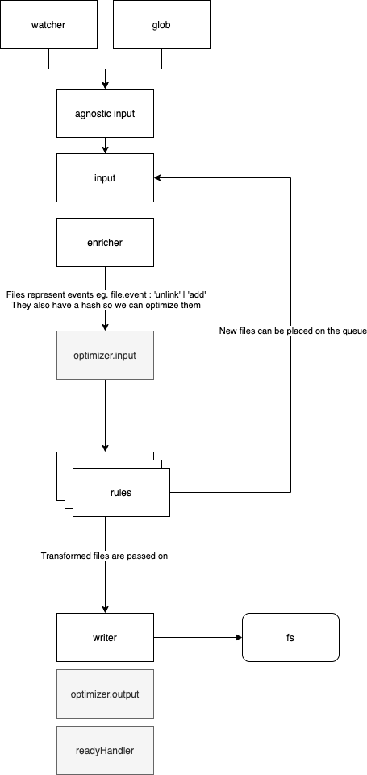

# `@blitzjs/file-pipeline`

## File Transformation Pipeline

### Design goals

- Stages: Related logic needs to live together
- Everything is a stream
- Efficiency
- Parallel processing
- Cleaner Architecture for Dirty restart functionality
- Agnostic input file watcher / glob
- Simplify tests

This package provides a gulp based pipeline for transforming files from a source to a destination across a series of stages.

```ts
import {transformFiles} from '@blitzjs/file-pipeline'
import through from 'through2'
import File from 'vinyl'

// This is an example of a stage that does nothing to the
// files as they pass through the pipeline
const myStage = () => ({
  stream: through.obj((file:File, _, next) => {
    // Normally transformation will take place here
    next(null, file)
  })
})

const mySecondStage = () => ({
  stream: through.obj((file:File, _, next) => {
    // Normally transformation will take place here
    next(null, file)
  })
})

// Files start off at the source
const src = '/path/to/src'
// Pass through the stages one by one
const stages = [
  myStage,
  mySecondStage
]
// Then end up at the destination
const dest = '/path/to/dest'

// We can set various options they are all optional
const options = {
  // This indicates if the file watcher will be turned on
  watch:true,
  // this is a list of source files globs to ignore
  ignore: [],
  // this is a list of source files globs to include
  include: ['**/*']
  // pass in an optional transform stream that will be used as an event bus
  bus: someTransformStream
}

// run the transform
transformFiles(src, stages, dest, options),
```

## Stages

Stages are how you provide special behaviour to your file-pipeline.

The anatomy of your stage looks like this:

```ts
function myStage({
  // Stage config holds the basic info you need for the stage
  config: {
    // src folder
    src,
    // dest folder
    dest,
    // current working directory
    cwd,
    // include globs
    include,
    // ignore globs
    ignore,
    // if we are in watch mode
    watch,
  },
  // Input writable stream - use input.write(file) to send a file the input of the pipeline
  input,
  // Event bus stream - use this to send events to listeners within and outside of the pipeline
  bus,
  // Get the input cache.
  // This is an object that contains cached objects for all the files ingested.
  // Use this for things that require lists of files
  getInputCache,
}: StageArgs) {
  // Create some kind of transform stream
  const stream = createSomeKindOfTransformStream()

  // Ready - is an object that will be merged with all other
  // Stages and returned in a promise by  transformFiles()
  const ready = {foo: "This will appear in the object returned by transformation promise"}

  // Export the stream and the ready info
  return {stream, ready}
}
```

# Why Streams?

Initially, Blitz will be used by people with small projects however as the number files and throughput increases we will need to use an architecture that allows for large parallel throughput with low memory consumption. Node is built on streams as a primitive so it makes sense to utilize what is available. The Gulp ecosystems provide several tools for managing streams of files so that makes sense to use those tools when available. Because refactoring to streams later would be extremely difficult and painful not starting with streams would be a design mistake.

# Why not RxJS?

RxJS could be a good match for streaming architectures and introduces some really powerful tools for managing stream operations. As we are using object streams it would also possibly simplify some of the boilerplate using RxJS. However, certain operators in RxJS can be inapproachable for newer developers and tend to encourage too much abstraction. It is also an extra dependency that increases the learning surface of the codebase and as we are stuck with understanding basic node streams, in any case, it makes sense to avoid RxJS until absolutely necessary.

## File Transform Pipeline



# Stream helpers

So Node streams are a little incompatible on old versions of Node and there are a few compatibility libs we are using to help us work with streams.

https://www.freecodecamp.org/news/rxjs-and-node-8f4e0acebc7c/

Helper Libs

- Pipe - [pump](https://npmjs.com/package/pump)
- Pipeline - [pumpify](https://npmjs.com/package/pumpify)
- Through - [through2](https://npmjs.com/package/through2)
- Concat - [concat-stream](https://npmjs.com/package/concat-stream)
- Parallel - [parallel-transform](https://npmjs.com/package/parallel-transform)
- Node Compat - [readable-stream](https://npmjs.com/package/readable-stream)

# A good way to work with streams

A pattern we have found that works well is using a constructor function to accept connectors and return a stream as well as any shared data you need to provide to other components connectors. You will see this a lot around the synchronizer.

```ts
type CreatorFn = ConnectionsOrConfig => StreamAsWellAsSharedData
```

An example might look like this:

```ts
// Config -> Merged Glob && FileWatcher
const source = agnosticSource({cwd: src, include, ignore, watch})

// you can then pipe the stream to a pipeline
pipe(source.stream, fileTransformPipeline)
```

The reason we don't just return a stream is that often we need to return other data and share it elsewhere, for example, to analyze input file structure in the pages rule we use a file cache.

```ts
// Here
const fileCache = createFileCache(config)
const pageRule = createPageRule(fileCache.cache)

pipeline(
  fileCache.stream, // manages the fileCache to be used by other streams
  // ...
  pageRule.stream, // has access to the fileCache
)
```

# View rendering and error handling

The cli view is provided by a stream which accepts Events which it manages and displays. This is responsible for rendering stuff to the view.

If you push an Error to the transform stream `next(new Error)` an Error Event will be sent over the event bus. This can get handled by some event handling logic in your Stage.

# Evented Vinyl Files

Evented Vinyl Files are [Vinyl Files](https://github.com/gulpjs/vinyl) with events attached to them

```ts
const isDelete = (file) => file.isNull() && file.event === "unlink"

// The input file at '/path/to/foo' was deleted
// This can be transformed during the process phase
return new Vinyl({
  path: "/path/to/foo",
  content: null,
  event: "unlink",
})
```

```ts
// Add file at '/path/to/foo'
new Vinyl({
  path: "/path/to/foo",
  content: someContentStream,
})
```

# Input agnostic

Pipeline is input agnostic ie. it should not matter if it comes from watch or a folder glob so to help with that we have created an agnostic input stream that takes glob config and returns a file stream. It consumes input from both chokidar and vinyl-fs.

# Optimization

Input manages inputting of evented vinyl file. Files that have already been processed or are currently being processed should not be processed again. Here we try and manage a running list of files to work on based on the hash of their filename and mtime.

# Analysis

Some types of analysis need a list of all the files other types do not

Analysis needs to be done in stream as new information comes in. Eg. when someone renames a file that file goes to the analysis engine which works out invariants as they occur without requiring a sweep of the entire file system.

For this, we can create file caches which represent projections of the file system and update based on input file events.

# Stages

Stage streams represent specific things we need the `file-pipeline` to do

Possible things it can do:

- Change its path or contents
- Drop the file from further processing. Don't copy it.
- Add new files to the input stream - Associating the new files with the original
- Write an error to the error stream

```ts
import {through} from './streams'

// Typical Stage
export default myStage({config, input, getInputCache}) => {
  const service = createSomeService()

  // This is an incremental file cache that
  // gets built as Files are read
  const cache = getInputCache()

  // You should not write to the file system use input.write() instead to send
  // a new file down the pipelin
  if (!pathExistsSync(resolve(config.src, 'blitz.config.js'))) {
    input.write(
      new File({
        path:resolve(config.src, 'blitz.config.js'),
        content:Buffer.from('Hello World')
      })
    )
  }

  const stream = through.obj(function (file, enc, next) {
    // You can test for changes in the input cache
    if (cache.filter(/next\.config\.js$/.exec).length > -1) {
      const err = new Error('Cannot have next config!')
      err.name = 'NextConfigError'
      next(err) // Will cause an Error Event to be fired on the event bus
    }

    // process file in some way
    file.path = file.path.toUpperCase()

    // you can push to the stream output (note you cannot use arrow fns)
    this.push(file)

    // You can push new files to the output too but this is a little dodgy
    // One issue here is that this file will not be registered as a piece
    // of work and this may have unintended consequences.
    // This is still ok in many situations but it is safer to write to the input.
    // (note input.write vs this.push)
    this.push(
      new File({
        path: '/path/to/foo',
        content: Buffer.from('This is a file')
      })
    )

    // or send file onwards to be written this does the same thing as this.push()
    next(null, file)
  })

  // provide an object that will be merged with other ready
  // objects to form the return of the transformFiles return promise value
  const ready = {
    foo: 'I am foo'
  }

  return {
    stream,
    ready,
    service, // provide that service to consumers outside the stream
  }
}
```
