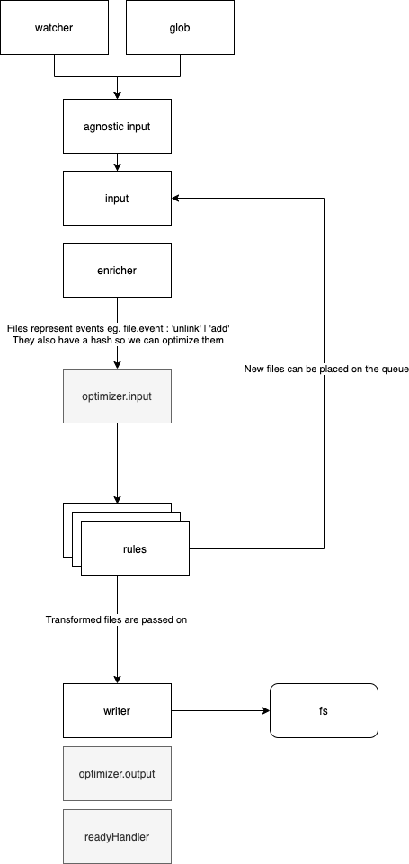
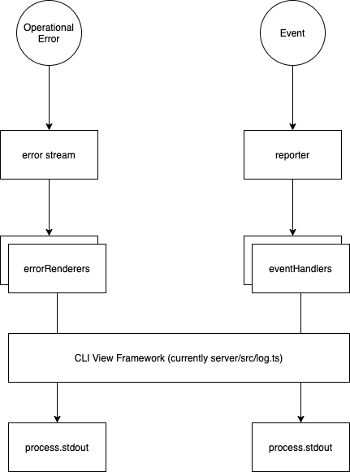

# Synchronizer

Design goals

- Rules: Related logic needs to live together
- Everything is a rule
- Efficiency
- Parallel processing
- Cleaner Architecture for Dirty restart functionality
- Agnostic input file watcher / glob
- Simplify tests

# Why Streams?

Initially, blitz will be used by people with small projects however as the number files and throughput increases we will need to use an architecture that allows for large parallel throughput with low memory consumption. Node is built on streams as a primitive so it makes sense to utilize what is available. The Gulp ecosystems provide several tools for managing streams of files so that makes sense to use those tools when available. Because refactoring to streams later would be extremely difficult and painful not starting with streams would be a design mistake.

# Why not RxJS?

RxJS could be a good match for streaming architectures and introduces some really powerful tools for managing stream operations. As we are using object streams it would also possibly simplify some of the boilerplate using RxJS. However, certain operators in RxJS can be inapproachable for newer developers and tend to encourage too much abstraction. It is also an extra dependency that increases the learning surface of the codebase and as we are stuck with understanding basic node streams, in any case, it makes sense to avoid RxJS until absolutely necessary.

# Broad Architecture

Our architecture is a big file transform pipeline. Every business concern is colocated in a rule which basically exports a stream. There are rules for general business concerns such as:

- Blitz Config
- Compiling Routes
- RPC Generation
- File lookup table generation

## File Transform Pipeline



# Stream helpers

So Node streams are a little incompatible on old versions of Node and there are a few compatibility libs we are using to help us work with streams.

https://www.freecodecamp.org/news/rxjs-and-node-8f4e0acebc7c/

Helper Libs

- Pipe - [pump](https://npmjs.com/package/pump)
- Pipeline - [pumpify](https://npmjs.com/package/pumpify)
- Through - [through2](https://npmjs.com/package/through2)
- Concat - [concat-stream](https://npmjs.com/package/concat-stream)
- Parallel - [parallel-transform](https://npmjs.com/package/parallel-transform)
- Node Compat - [readable-stream](https://npmjs.com/package/readable-stream)

# A good way to work with streams

A pattern we have found that works well is using a constructor function to accept connectors and return a stream as well as any shared data you need to provide to other components connectors. You will see this a lot around the synchronizer.

```ts
type CreatorFn = ConnectionsOrConfig => StreamAsWellAsSharedData
```

An example might look like this:

```ts
// Config -> Merged Glob && FileWatcher
const source = agnosticSource({cwd: src, include, ignore, watch})

// you can then pipe the stream to a pipeline
pipe(source.stream, fileTransformPipeline)
```

The reason we don't just return a stream is that often we need to return other data and share it elsewhere, for example, to analyze input file structure in the pages rule we use a file cache.

```ts
// Here
const fileCache = createFileCache(config)
const pageRule = createPageRule(fileCache.cache)

pipeline(
  fileCache.stream, // manages the fileCache to be used by other streams
  // ...
  pageRule.stream, // has access to the fileCache
)
```

# View rendering and error handling

The cli view is provided by a [reporter](./reporter) stream which accepts Events which it manages and displays. This is responsible for rendering stuff to the view.

Secondly there is an [errors](./errors) stream which works a similar way but for Operational Errors.

It is important to differentiate between Operational Errors and Exceptions. Exceptions are probably programmer errors whereas operation errors are more likely a result of the user providing us with the wrong input/files.

In this architecture, we write operational errors to the error stream and catch Exceptions in stream error handlers. We should be able to drop Exceptions on the floor but by attaching a view to the end of the error stream we can print nice messages for our users.

Because everything is streams we can get pretty creative with how we present stuff to the user and get realtime updates to it. This might make it easier to integrate with Reactive cli view frameworks at a later point.



# Synchronizer Event Pipeline

The main element within the file synchronizer is the [file transform pipeline](./pipeline/index.ts).

This is a big stream pipeline that handles the transformation and writing of files. The concept is that you can write an [evented vinyl file object](#evented-vinyl-files) to it and it will run a series of transformations on that file and write it to disk or delete it at the end.

# Evented Vinyl Files

Evented Vinyl Files are [Vinyl Files](https://github.com/gulpjs/vinyl) with events attached to them

```ts
const isDelete = (file) => file.isNull() && file.event === 'unlink'

// The input file at '/path/to/foo' was deleted
// This can be transformed during the process phase
return new Vinyl({
  path: '/path/to/foo',
  content: null,
  event: 'unlink',
})
```

```ts
// Add file at '/path/to/foo'
new Vinyl({
  path: '/path/to/foo',
  content: someContentStream,
})
```

# Input agnostic

Pipeline should be input agnostic ie. it should not matter if it comes from watch or a folder glob so to help with that we have created an agnostic input stream that takes glob config and returns a file stream. It consumes input from both chokidar and vinyl-fs.

# Optimization

Input manages inputting of evented vinyl file. Files that have already been processed or are currently being processed should not be processed again. Here we try and manage a running list of files to work on based on the hash of their filename and mtime.

# Analysis

Some types of analysis need a list of all the files other types do not

Analysis needs to be done in stream as new information comes in. Eg. when someone renames a file that file goes to the analysis engine which works out invariants as they occur without requiring a sweep of the entire file system.

For this, we can create file caches which represent projections of the file system and update based on input file events.

# Rules

Rule streams represent Blitz specific rules we need the synchronizer to do

Possible things it can do:

- Change its path or contents
- Drop the file from further processing. Don't copy it.
- Add new files to the input stream - Associating the new files with the original
- Write an error to the error stream

Rules can create a new file to add to the head of the queue

They can hold state in a closure.

They should be managed in a list.

The entire chain can be a list of streams.

# Examples

Some code examples

```ts
// Rules represent business rules
const rulePages = createRulePages(api)
const ruleRpc = createRuleRpc(api)
const ruleConfig = createRuleConfig(api)
const ruleWrite = createRuleWrite(api)

const stream = pipeline(
  // They can then be used in the pipeline
  input,
  rulePages.stream,
  ruleRpc.stream,
  ruleConfig.stream,
  ruleWrite.stream,
)
```

```ts
import {through} from './streams'

// Typical Rule
export default ({config, input, errors, getInputCache}) => {
  const service = createSomeService()

  // This is an incremental file cache that
  // gets built as Files are read
  const cache = getInputCache()

  // Probing sync methods are probably ok here as this is effectively synchronous and could be
  // considered bootstrapping and runs first but you should not write to the file system
  // Use input.write() instead.
  if (!pathExistsSync(resolve(config.src, 'blitz.config.js'))) {
    input.write(resolve(config.src, 'blitz.config.js'), 'Hello World')
  }

  const stream = through.obj(function (file, enc, next) {
    // You can test for changes in the input cache
    if (cache.filter(/next\.config\.js$/.exec).length > -1) {
      const err = new Error('Cannot have next config!')
      err.name = 'NextConfigError'
      errors.write(err)
    }

    // process file in some way
    file.path = file.path.toUpperCase()

    // you can push to the stream output (note you cannot use arrow fns)
    this.push(file)

    // or send file onwards to be written this does the same thing as this.push()
    next(null, file)
  })

  return {
    stream,
    service, // provide that service to consumers outside the stream
  }
}
```

# Future thinking

So one future issue we have been trying to account for here is how to solve the dirty sync problem with streams. Basically, we want Blitz to do as little work as possible. At this point, we are blowing away blitz folders when we start but it would be smarter to analyze the source and destination folders and only manipulate the files that are actually required to be changed. This is not required as of now but will be a consideration as we try and get this thing faster and faster to live up to its name. To prepare for this we have setup a work optimizer that checks the hash of the input file and guards against new work being done

The following is a rough plan for how to do this. (Likely to change/improve at a later point)

- Encode vinyl files + stats

```ts
const hash = crypto
  .createHash('md5')
  .update(file.path + file.stats.mtime)
  .digest('hex')

file.hash = hash
```

- Use those hashes to index file details in the following structures:

Following

```ts
// reduced to as the first step during input
const input = {abc123def456: '/foo/bar/baz', def456abc123: '/foo/bar/bop'}

// reduced to as the last step just before file write
const complete = {
  abc123def456: {
    input: '/foo/bar/baz',
    output: ['/bas/boop/blop', '/bas/boop/ding', '/bas/boop/bar'],
  },
  def456abc123: {
    input: '/foo/bar/bing',
    output: ['/bas/boop/ping', '/bas/boop/foo', '/bas/boop/fawn'],
  },
  cbd123aef456: {
    input: '/foo/bar/bop',
    output: ['/bas/boop/thing'],
  },
}
```

Has this file hash been processed?

```ts
const hash => !!output[hash];
```

Which files do I need to delete based on input?

```ts
const deleteHashes = Object.keys(output).filter((hash) => input[hash])
```

- Output can also be indexed by filetype to keep going with our hacky error mapping (eventually this should probably be a sourcemap)

```json
{
  "/bas/boop/bar": "/foo/bar/baz",
  "/bas/boop/blop": "/foo/bar/baz",
  "/bas/boop/ding": "/foo/bar/baz",
  "/bas/boop/fawn": "/foo/bar/bing",
  "/bas/boop/foo": "/foo/bar/bing",
  "/bas/boop/ping": "/foo/bar/bing",
  "/bas/boop/thing": "/foo/bar/bop"
}
```

Does my output match my input ie. am I in a stable state? or in our case can we return the promise.

```ts
function isStable(input, output) {
  if (!input || !output) {
    return // We are not stable if we don't have both an input or output
  }

  const inputKeys = Object.keys(input)
  const outputKeys = Object.keys(output)

  if (inputKeys.length !== outputKeys.length) {
    return false
  }
  match = true
  for (let i = 0; i < inputKeys.length; i++) {
    match = match && outputKey[i] === inputKeys[i]
    if (!match) {
      return false
    }
  }
  return true
}
```
